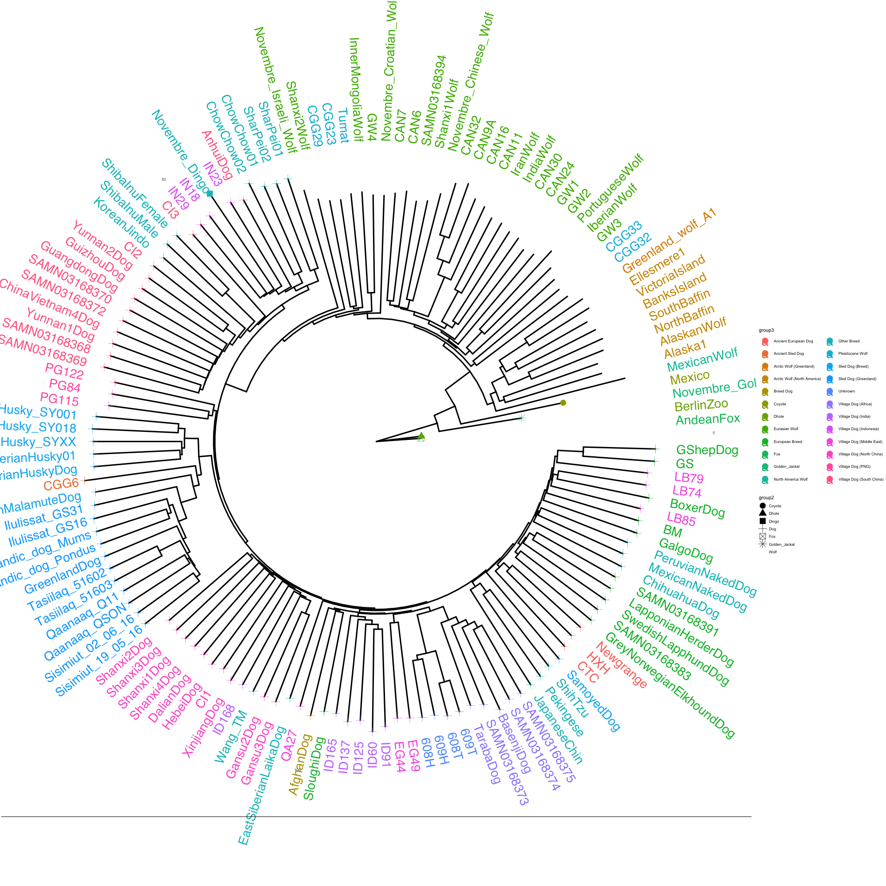

# Friday Week38

## Work plan

This week we are going to learn how to create and manipulate phylogenetic trees in R with the package `ape`. For that, a basic understanding of R is required as well as installing R in your machines. I'll poste here some tutorials in case you need to learn basic R and links to where you can find R and R studio downloads. 

### 1. R installation and tutorials

In this section, I'll post to some useful links to download, install and learn R. You don't need to follow this if you have a basic understanding of R. If you need to learn R, I recomend that you do these tutorials. If you find some parts of the tutorial challenging or complicated, don't force yourself and skip those parts or leave them for latter. 

#### 1.1. Downloading and installing R and R studio

- This [link](https://education.rstudio.com/learn/beginner/) contains lots of useful material to both install and learn R. Start clicking on the [R](https://cloud.r-project.org) and [Rstudio](https://rstudio.com/products/rstudio/download/) in the previous link (or the ones I provide), download and install both in your machine. 

#### 1.2. R tutorials

- To get started, you can follow the [BasicBasics1](https://rladiessydney.org/courses/ryouwithme/01-basicbasics-1/) brief tutorial of what are the different windows in Rstudio and the handy options, produced by R-Ladies Sydney. I also recomend to watch the youtube [video](https://youtu.be/kfcX5DEMAp4).

    + In the BasicBasics 1 video, they talk about R Projects. Don't worry about that, we are not going to use them in this course. 
    
- In the [education rstudio page](https://education.rstudio.com/learn/beginner/) you will find that they recomend to follow chapter *Getting Started with R and RStudio* (although the chapter is actually called *Getting Started with Data in R* on the webpage) from a book entitled *ModernDive*. Follow the [*Getting Started with R and RStudio*](https://moderndive.netlify.app/1-5-conclusion.html).

- With this you should have enough to get started but, if you want more, you can find lots of other R courses and tutorials on internet. For example, I also recomend this [page](https://whitlockschluter.zoology.ubc.ca/r-code), especially the [Brief intro to R](https://whitlockschluter.zoology.ubc.ca/r-code/intror). 

- I will be using rmarkdown files (instead of basic R text files) to run the exercises. I think they are a great tool to combine notes with code and they create an output which is perfect to read afterwards. Thus, if you are unfamiliar with rmarkdown, I recomend that you also learn the basics. [Here](https://rmarkdown.rstudio.com/articles_intro.html) you have a brief intro to rmarkdown. Again, you can find more info and other tutorials such as this 8 min youtube [video](https://www.youtube.com/watch?v=1XJTddpcj3w) that summarises what rmarkdown esentially is. If you have trouble remembering all the rmarkdown concepts, sintaxi and others check this practical [cheat sheet](https://rstudio.com/wp-content/uploads/2015/02/rmarkdown-cheatsheet.pdf).

### 2. Phylogenetics in R with `ape`

Once you are more confident with R, you can follow the introduction to the `ape` package to analyse phylogenetic data in R. For that, you should download the [Week39download.zip](Week39download.zip) and open the `ape_intro.Rmd`. This gives you a brief overview of how to play with tree structures in R and what you can do. Note that when I wanted to comment on something, I write it as:

> MOI: this is a Moi comment

You can check my output [here](ape_intro.md).

> Jilong:

If you already know some about R and the tidyverse. Here is an tree visualization extension with ggplot-like version.

[ggtree](https://yulab-smu.top/treedata-book/chapter4.html)

See [Installation of ggtree](https://bioconductor.org/packages/release/bioc/html/ggtree.html) as the install.packages("ggtree") might not work for R version 4.2.1

If you successfully install all the required packages realted to ggtree, you might try the following example codes to reproduce the shown figures or even customizing a bit yourself :)

Examples for creating an phylogeny tree for 140 canid individuals and customizing colors and shapes of tipnodes and tiplabels according to the canid group information. See reference at [140-canids](https://github.com/Jilong-Jerome/Evolutionary_Thinking_2022/tree/main/week38/Friday/dog_nj_tree)

 
